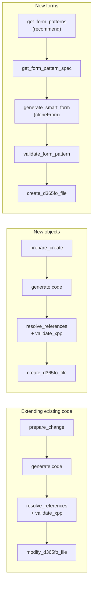

# Tool Reference — 60 Tools

Every tool the server exposes, grouped by purpose. The AI agent picks tools automatically — the *example prompts* show what to ask to trigger them; you never name tools yourself.

> **C# bridge first:** on Windows D365FO VMs, 16 read tools query the live `IMetadataProvider` (always-fresh metadata) and `DYNAMICSXREFDB` (compiler-resolved cross-references), falling back to SQLite transparently on Azure/Linux. All write operations go exclusively through the bridge. See [BRIDGE.md](BRIDGE.md) and [SQLITE_DEPENDENCY.md](SQLITE_DEPENDENCY.md).
>
> **Server modes:** `full` = all 60 tools · `read-only` (Azure) = search/analysis only · `write-only` (hybrid companion) = file operations + bridge-backed reads. See [MCP_CONFIG.md](MCP_CONFIG.md).

---

## Recommended workflows

The grounding chain is what makes generated code compile on the first try:

| Workflow | Chain | Gate |
|----------|-------|------|
| CoC / event handler / extension | `prepare_change` → generate → `resolve_references` + `validate_xpp` → `modify_d365fo_file` | grounding token + reference proof |
| New class / table / enum | `prepare_create` → generate → `resolve_references` + `validate_xpp` → `create_d365fo_file` | grounding token + collision check |
| New form | `get_form_patterns(recommend)` → `get_form_pattern_spec` → `generate_smart_form(cloneFrom)` → `validate_form_pattern` → `create_d365fo_file` | structural pattern gate (FP001–FP010) |

---

## 🔍 Search & Discovery (8)

| Tool | What it does | Example prompt |
|------|--------------|----------------|
| `search` † | Search 580K+ symbols by name or keyword (FTS5, < 10 ms) | *"Find classes related to sales order posting"* |
| `batch_search` | Multiple searches in one round-trip (3× faster) | *"Look up CustTable, SalesLine and PaymTerm at once"* |
| `search_extensions` | Search only custom/ISV models (filters out Microsoft code) | *"What extensions do we have on VendTable?"* |
| `get_class_info` † | Full class: methods with source, inheritance, attributes | *"Show me the structure of SalesFormLetter"* |
| `get_table_info` † | Full table: fields, indexes, relations, methods | *"What fields and indexes does CustTrans have?"* |
| `get_enum_info` † | Enum values with integers and labels | *"List the values of SalesStatus"* |
| `get_edt_info` † | EDT base type, extends chain, labels, properties | *"What does the AmountCur EDT extend?"* |
| `code_completion` | IntelliSense-style member listing with prefix filter | *"Methods on SalesTable starting with calc"* |

† = bridge-first on Windows D365FO VMs

## 📊 Advanced Object Info (7)

| Tool | What it does | Example prompt |
|------|--------------|----------------|
| `get_form_info` † | Form datasources, control hierarchy, methods | *"Show the control tree of the CustTable form"* |
| `get_query_info` † | Query datasources, joins, ranges | *"How is the CustTableListPage query built?"* |
| `get_view_info` † | View / data entity fields, relations, computed columns | *"Structure of CustTransOpenView?"* |
| `get_report_info` † | SSRS report datasets, designs, RDL summary | *"Datasets of the SalesInvoice report?"* |
| `get_method_signature` † | Exact signature — **mandatory before CoC** | *"Signature of SalesFormLetter.run?"* |
| `get_method_source` † | Full X++ source of a method | *"Show me the body of CustTable.validateWrite"* |
| `find_references` † | Where-used analysis, xref-enriched (reference type, caller class/method) | *"Where is updateInventory called from?"* |

## 🏷️ Label Management (4)

| Tool | What it does | Example prompt |
|------|--------------|----------------|
| `search_labels` | Full-text search across 20M+ label rows, all languages | *"Is there a label for 'payment terms'?"* |
| `get_label_info` | All translations of a label ID | *"Show translations of @SYS12345"* |
| `create_label` | Add a label to all language files of a model | *"Create label 'Priority tier' in en-US, cs, de"* |
| `rename_label` | Rename a label ID across .label.txt, X++ and XML | *"Rename label MyOldId to MyNewId everywhere"* |

## 🧠 Code Intelligence (6)

| Tool | What it does | Example prompt |
|------|--------------|----------------|
| `get_xpp_knowledge` | Queryable X++ rulebook: select grammar, CoC, SysDa, FormRun lifecycle, form patterns, AX2012→D365FO migration | *"What are the rules for crossCompany selects?"* |
| `get_d365fo_error_help` | Compiler / runtime / BP errors explained with concrete fixes | *"Explain error 'object not initialized' in batch"* |
| `analyze_code_patterns` | Common patterns for a scenario, mined from the codebase | *"How are number sequences usually implemented here?"* |
| `suggest_method_implementation` | Real implementations of similar methods | *"How do other classes implement validateWrite?"* |
| `analyze_class_completeness` | Missing standard methods on a class | *"What standard methods is my service class missing?"* |
| `get_api_usage_patterns` † | How an API is initialized and called (compiler-resolved callers) | *"How is LedgerJournalCheckPost typically used?"* |

## 🎨 Smart Object Generation (4)

| Tool | What it does | Example prompt |
|------|--------------|----------------|
| `generate_smart_table` | Pattern-aware table XML with EDT suggestions | *"Create an audit log table with SalesId, PostedAt, PostedBy"* |
| `generate_smart_form` | Pattern-aware form generation — **clones reference forms** (`cloneFrom` + `tableMapping`, patterns and sub-patterns preserved), template fallback, optional lifecycle method stubs (`includeMethodStubs`) | *"Create a SimpleList form for MyRentalGroup by cloning CustGroup"* |
| `generate_smart_report` | Complete SSRS stack in one call: TmpTable + Contract + DP + Controller + AxReport/RDL | *"Create report InventByZones with these 7 fields"* |
| `suggest_edt` | EDT suggestions for a field name (fuzzy, confidence-ranked) | *"Which EDT for a field CustomerAccount?"* |

## 🧩 Form Patterns (3)

| Tool | What it does | Example prompt |
|------|--------------|----------------|
| `get_form_patterns` | **Pattern advisor** — `recommend={entityKind, fieldCount, usageIntent, tableName}` returns the right pattern + reference forms to clone (Microsoft decision tree + mined usage from your environment); also analyzes existing forms by pattern/table/similarity | *"Which form pattern fits a setup table with 15 fields?"* |
| `get_form_pattern_spec` | Full pattern spec: required containers and ordering, allowed sub-patterns per container, known versions, reference forms, lifecycle method guidance | *"Show me the structure rules of DetailsTransaction"* |
| `validate_form_pattern` | Structural validation, rules FP001–FP010: hierarchy, ordering, sub-pattern usage, versions, datasource expectations — structural errors **block form writes** (`FORM_PATTERN_ENFORCE`) | *"Validate this form XML against its pattern"* |

## 📈 Pattern Analysis & Codegen (3)

| Tool | What it does | Example prompt |
|------|--------------|----------------|
| `get_table_patterns` | Field/index patterns for table groups | *"What do parameter tables typically look like?"* |
| `generate_code` | X++ boilerplate: SysOperation, CoC, event handler, business event, custom service, lookup form, … | *"Generate a SysOperation skeleton for VendRecalc"* |
| `generate_d365fo_xml` | XML preview without writing (cloud-friendly) | *"Show me the XML for this enum without creating it"* |

## 📝 File Operations (3)

| Tool | What it does | Example prompt |
|------|--------------|----------------|
| `create_d365fo_file` | Create any of 18 AOT object types in the correct location + register in `.rnrproj` — gated by grounding token and form-pattern validation | *"Create the class file in my project"* |
| `modify_d365fo_file` | Safe metadata edits via the C# bridge — 25 operations: add-field, add-control, add-method, replace-code, modify-property, … | *"Add the field to the General tab of the form extension"* |
| `undo_last_modification` | Revert the last write: checkout HEAD or delete untracked file | *"Undo that last change"* |

## 🔐 Security & Extensions (12)

| Tool | What it does | Example prompt |
|------|--------------|----------------|
| `get_security_artifact_info` | Privilege / duty / role details + full hierarchy | *"What does the duty VendPaymentTermsMaintain contain?"* |
| `get_security_coverage_for_object` | Which roles reach a form/table/menu item (Role → Duty → Privilege → Entry Point) | *"Who has access to the VendPaymTerms form?"* |
| `get_menu_item_info` | Menu item target, type, security chain | *"Where does menu item CustTable lead?"* |
| `find_coc_extensions` † | Existing CoC wrappers of a method — **check before writing a new one** | *"Is SalesFormLetter.run already wrapped by CoC?"* |
| `find_event_handlers` † | All `[SubscribesTo]` handlers for an event | *"What subscribes to CustTable onInserted?"* |
| `get_table_extension_info` † | All extensions of a table: fields, indexes, methods | *"What fields have we added to CustTable?"* |
| `get_data_entity_info` † | Entity category, OData settings, data sources, keys | *"Details of the CustCustomerV3 entity"* |
| `analyze_extension_points` † | CoC-eligible methods, delegates, events on an object | *"What can I extend on SalesFormLetter?"* |
| `recommend_extension_strategy` | Best extensibility mechanism for a goal | *"How should I customize sales confirmation posting?"* |
| `validate_object_naming` | Naming conventions + symbol-index collision check | *"Is MY_VendPaymTermsMaintain a valid name?"* |
| `get_workspace_info` | Detected paths, model, project, server mode + **index staleness warning** — call first in every session | *"Check my workspace configuration"* |
| `verify_d365fo_project` | Objects exist on disk and in the `.rnrproj` | *"Verify everything we created is in the project"* |

## 🏗️ SDLC & Build (5)

> Local-only — require a Windows D365FO VM; excluded from the Azure `read-only` mode.

| Tool | What it does | Example prompt |
|------|--------------|----------------|
| `build_d365fo_project` | MSBuild compilation with structured xppc diagnostics (severity, object, line, fix hints for the first errors) | *"Build the project and show the errors"* |
| `trigger_db_sync` | Database sync for the current model | *"Sync the database"* |
| `run_bp_check` | Microsoft Best Practices (xppbp.exe) analysis | *"Run a BP check on my model"* |
| `run_systest_class` | Execute SysTest unit tests via SysTestRunner | *"Run the MyServiceTest class"* |
| `update_symbol_index` | Re-index a single changed file without restart | *"Refresh the index for the table I just created"* |

## ✅ Quality & Grounding (6)

| Tool | What it does | When it runs |
|------|--------------|--------------|
| `prepare_change` | One call before extending: signature + existing CoC wrappers + eligibility + strategy + **grounding token** | automatically, before modifications |
| `prepare_create` | One call before creating: collision check + naming + EDT/label suggestions + property defaults + **grounding token** | automatically, before new objects |
| `resolve_references` | Proves every type/field/method/label in generated code against the index — anti-hallucination gate | automatically, after generation |
| `validate_xpp` | Offline BP validator, < 50 ms: deprecated APIs, CoC correctness, select anti-patterns, data-driven XML property rules mined from standard models | automatically, after generation |
| `validate_form_pattern` | See [Form Patterns](#-form-patterns-3) | before form writes |
| `review_workspace_changes` | AI code review of uncommitted X++ changes (git diff) | on request: *"Review my changes"* |
> **Grounding enforcement:** `prepare_change` issues a SHA-256 provenance token (30-min TTL) **bound to the object it was issued for**. When `GROUNDING_ENFORCE=true` is set in `.env`:
> - extension patterns in `generate_code` and extension objectTypes in `create_d365fo_file` / `modify_d365fo_file` require a valid token for the target object, and
> - X++ source passed to `create_d365fo_file` / `modify_d365fo_file` is run through `resolve_references` — the write is rejected while any identifier cannot be proven against the index.
>
> This ensures generated code is grounded in your actual codebase, not AI training data.
>
> **Hybrid deployment note:** grounding tokens live in the issuing process's memory. In `write-only` mode (local companion) `prepare_change` is not exposed and tokens issued by the read-only/Azure instance cannot be validated locally, so `GROUNDING_ENFORCE=true` is **ignored** there (with a startup warning) — otherwise the agent would loop forever between the two servers. Only enable enforcement on a `full`-mode server.

---

## Tips
- **Describe goals, not tools.** The instruction files route requests automatically — *"add a priority field to CustTable and show it on the form"* triggers the whole chain.
- **Let the gates work.** `GROUNDING_ENFORCE` and `FORM_PATTERN_ENFORCE` (both default on) reject ungrounded or structurally invalid writes — that's the feature, not friction.
- **Verify after writing.** `verify_d365fo_project` confirms disk + project registration in one call.
- **Full conversations:** [USAGE_EXAMPLES.md](USAGE_EXAMPLES.md) shows seven real multi-tool scenarios end to end.